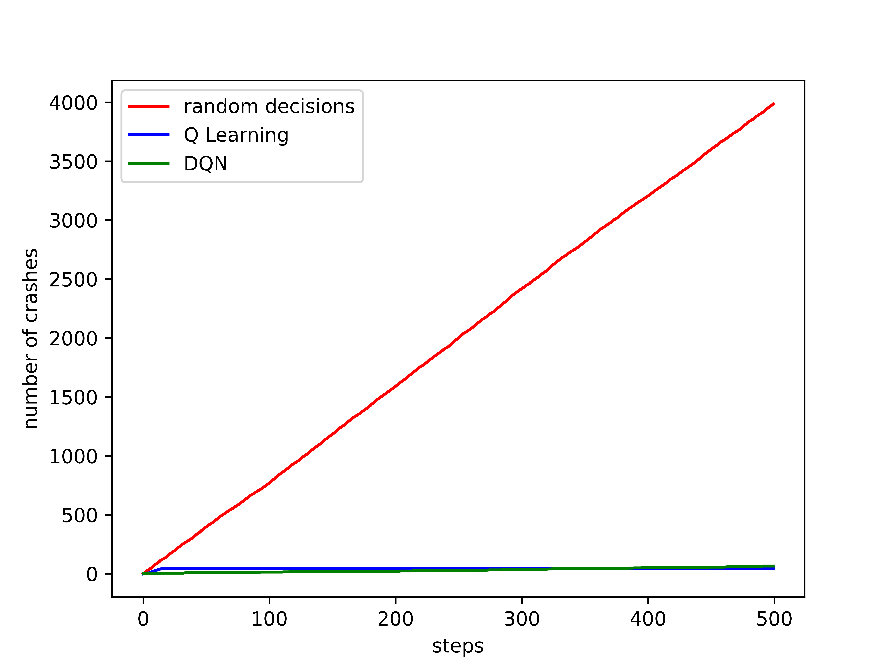

# drivesafe
Cars learn to obey trafic rules in a simplistic environment using Reinforcement Learning methods.
# Dependencies
* Python 3.8.5
# Authors
* Yuanyuan Mao (yybmao@gmail.com)
* Fabian Bernards (fabian.bernards@online.de)
# About the code
We have used two methods to train the model. 
* Q Learning (Based on »Reinforcement Learning: An Introduction«, Page 135).
* Deep Q Network (Based on [Nature 518.7540 (2015): 529-533](https://www.nature.com/articles/nature14236)).
# Training
Animation is turned off in the files *maintrain.py* and *maintrain_dqn.py* for training purpose. Before training one should tune the *Train* option in the settings to **True**. The trained models are saved as *qlearner.pkl* and */tmp/nmqnet/* for Q Learning and DQN, respectively.
# Performance
For an animation of the traffic of well-behaved cars, change *Train* option in */env/setting.py* to **False** andrun the *main.py* file.

We have run the untrained model(with random actions as output), trained Q Learning model, and trained DQN model 10.000 times each. The total number of crashes is recorded every 20 steps. We plot the total number of crashes for the three models in the image below, here the red line shows the perfomance of the untrained model, blue line the Q Learning Model, and green line the DQN model.

